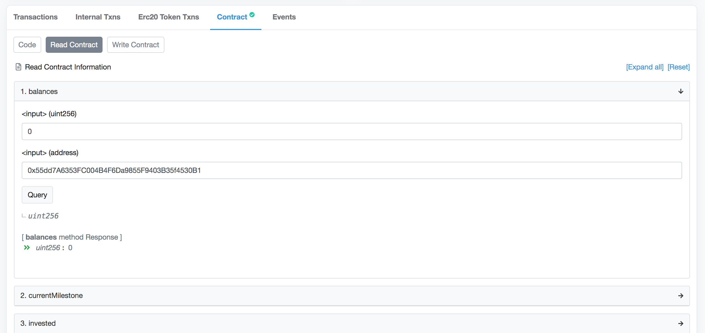
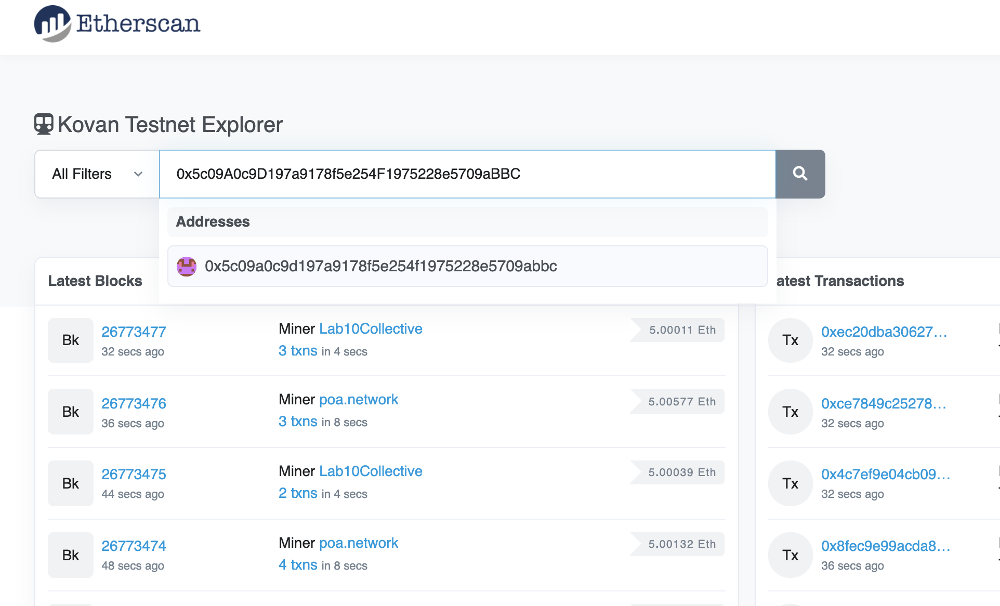
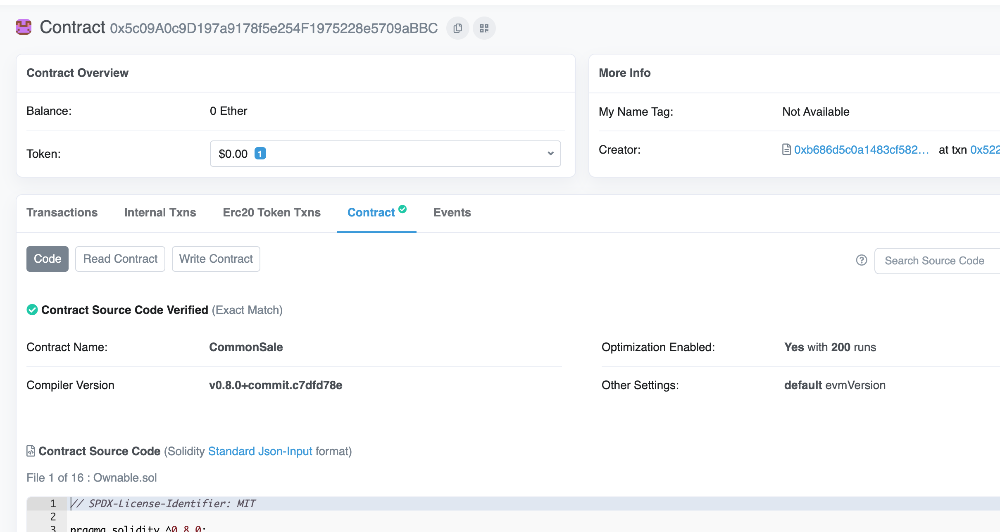
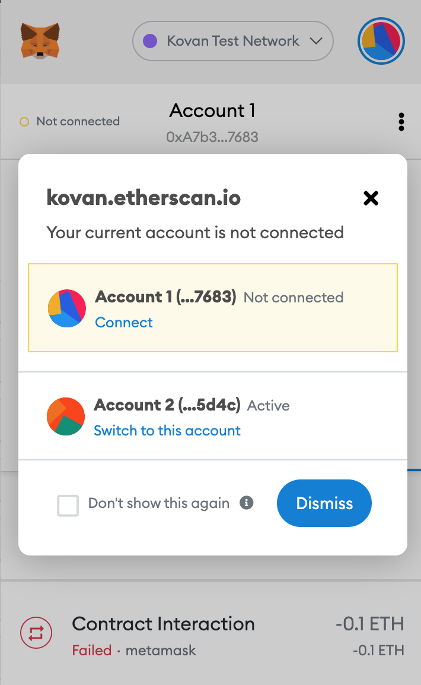
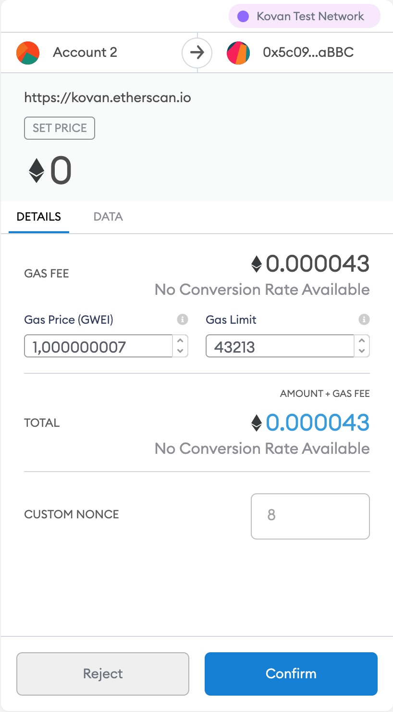
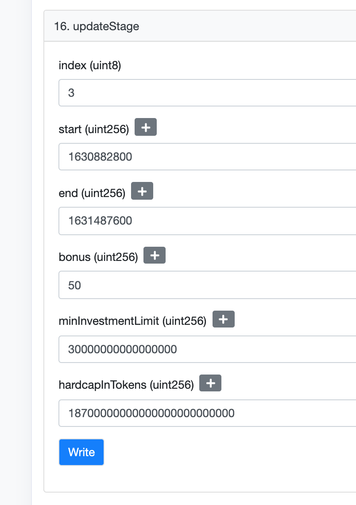
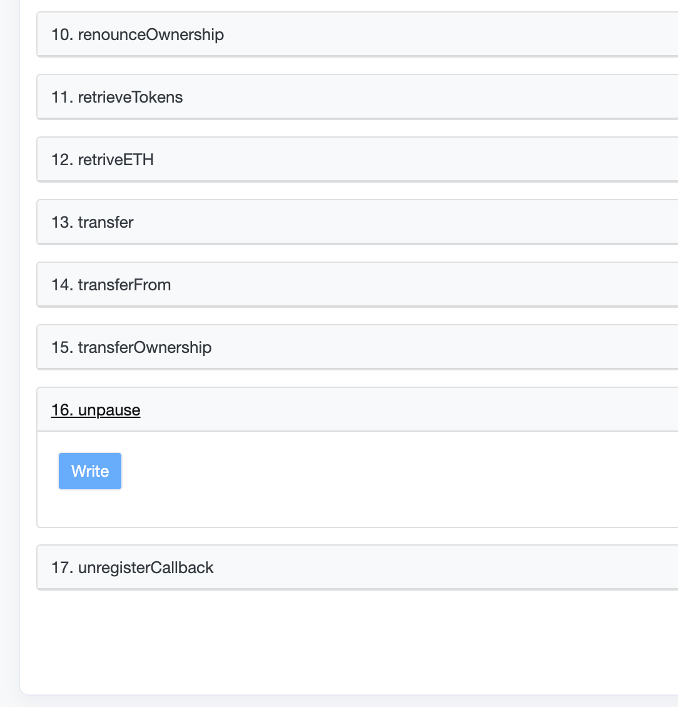

# The basics of smart contract interaction

> Attention! Some screenshots may contain addresses other than those actually used on the main network.
> Please, use the addresses provided in the body of this document or in the README file.

### Table of contents
* [Overview](#overview)
* [Obtaining the ABI interface](#obtaining-the-abi-interface)
* [How to read contract information using BscScan](#how-to-read-contract-information-using-BscScan)
* [Calling function](#calling-function)
* [How to set price in the CommonSale smart contract](#How-to-set-price-in-the-CommonSale-smart-contract)
* [How to update stage parameters in the CommonSale smart contract](#How-to-update-stage-parameters-in-the-CommonSale-smart-contract)
* [How to unlock token transfer](#How-to-unlock-token-transfer)
* [How to withdraw tokens from freezeWallet](#how-to-withdraw-tokens-from-freezewallet)

## Overview
Interaction with the smart contract is provided by calling smart contract functions with parameters.  
* First, you need to find out the `address` of the smart contract.
* With the address, you can get the `ABI interface`.
* Using the `ABI` you can call the target `function` of the smart contract.

## Obtaining the ABI interface

1. Go to the [bscscan.com](https://bscscan.com).
2. Enter smart contract address in the field `Search by address` and click `Search` button.
3. Go to the `Contract` section.

4. Click `Code` button
    

Click to see screenshot

    

    

5. Scroll down until you reach the `Contract ABI` section. Click `Copi ABI to clipboard` button.
    

Click to see screenshot

    

    

## How to read contract information using BscScan
The most convinient way to read information about smart contract is to use interface provided by [BscScan](https://bscscan.com).  
The first steps are similar to those described in the section [Obtaining the ABI interface](#obtaining-the-abi-interface):
1. Go to the [bscscan.com](https://bscscan.com).
2. Enter smart contract address in the field `Search by address` and click `Search` button.
3. Go to the `Contract` section.
4. Click `Read Contract` button. Now you can access contract's public information. You don't need to create a transaction to `read` the contract.
    

Click to see screenshot

   

    

## Calling function
1. Go to [bscscan.com](https://bscscan.com).
2. Enter smart contract address in `Search by Address` field and press `Enter`.
    

Click to see screenshot

    

    

3. Go to the `Contract` section. Click `Write Contract` button.
    

Click to see screenshot

    

    

4. Click `Contract to Web3` button and select your preferred wallet. We recommend using the MetaMask wallet.
    

Click to see screenshot

    

    

5. In the MetaMask window, select the address you want to use. Since all administrative functions of the smart contract are protected from being called by unauthorized persons, this must be the address of the smart contract's owner.
    

Click to see screenshot

    

    

6. Navigate to the function you want to call. Click on its name to expand the list of parameters. Fill in the form fields and click `Write` button.
    >Attention! Carefully check the entered data Before clicking `write` button. Sometimes the data format differs from the usual presentation.
    

Click to see screenshot

    

    

7. You will be redirected to MetaMask. Click `Confirm` button to send transaction to BSC network.
    

Click to see screenshot

   

    

## How to set price in the CommonSale smart contract
The final price that users pay when buying tokens is calculated from the following two parameters:
1) `Base price`. Common to all stages of the sale.
2) `Bonus in %`, which is applied to the number of tokens received upon purchase. Set separately for each stage of the sale.

> Attention! The `Base price` value is the amount of tokens that user receives for 1 BNB.

In the case when you need to adjust the BNB price of a token relative to its price in USD, we recommend using the `setPrice` function.  
Please, use the `Stages` tab of the `TGDAO` spreadsheet. You can find the parameter value that needs to be passed to the `setPrice` function in cell `J4`.  
The value in cell `J4` is calculated automatically from the value of the `BNB_USD` currency pair, which is regularly updated via `GOOGLEFINANCE`.

1. Follow steps 1-6 of the [Calling function](#calling-function) section.
2. Fill `newPrice` field.
    

Click to see screenshot

   
    
   
    

3. Click `Write` button and then click `Confirm` button, as described in step 7 of the [Calling function](#calling-function) section.

## How to update stage parameters in the CommonSale smart contract
Each stage of the sale is configured with the following parameters:
1) `id` - zero-based (the first stage has index `0`) index of stage. Use this value to select the exact stage you want to edit.
2) `start` - unix timestamp (in seconds) of the start of the stage.
3) `end` - unix timestamp (in seconds) of the end of the stage.
4) `bonus` - the `Base price` value is the amount of tokens that user gets for 1 BNB.
5) `minInvestmentLimit` - the mininum amount of `Wei` that user should send to the `CommonSale` contract to buy tokens.
6) `hardcapInTokens` - the maximum amount of tokens that can be sold during the stage.
7) `vestingSchedule` - the `id` of the vesting schedule applied to this stage. Set `0` if no vesting schedule is required.
   
Please, use the `Config` tab of the `TGDAO` spreadsheet. You can find the parameters that need to be passed to the `updateStage` function in columns from `O` to `T`.
The value in columns `M` - `Q` are automatically calculated from values set in columns `B` - `H`

1. Follow steps 1-6 of the [Calling function](#calling-function) section.
2. Fill `newPrice` field.
    

Click to see screenshot

   

    

3. Click `Write` button and then click `Confirm` button, as described in step 7 of the [Calling function](#calling-function) section.

## Pausable
CommonSale and TGDAOToken contracts inherit from OpenZeppelin's Pausable, which implements an emergency stop mechanism that can be triggered by an authorized account.  
In case of emergency, use the `Pause` function to prohibit users from performing any actions with the smart contract.  
`Unpause` returns the contract to its normal state.
1. Follow steps 1-6 of the [Calling function](#calling-function) section.
2. Click `Write` button and then click `Confirm` button, as described in step 7 of the [Calling function](#calling-function) section.
    

Click to see screenshot

    
  
    

## How to withdraw tokens from the VestingWallet
The VestingWallet contract makes tokens available for withdrawal according to schedule described in `Wallets` section of [README](/README.md).
In order to get released tokens beneficiary should [call](#calling-function) `withdraw` function of the VestingWallet smart contract.
