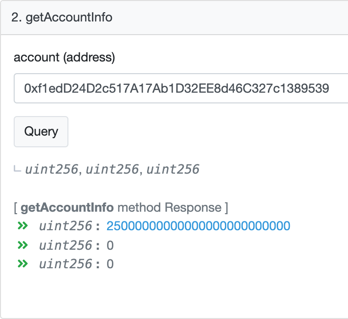
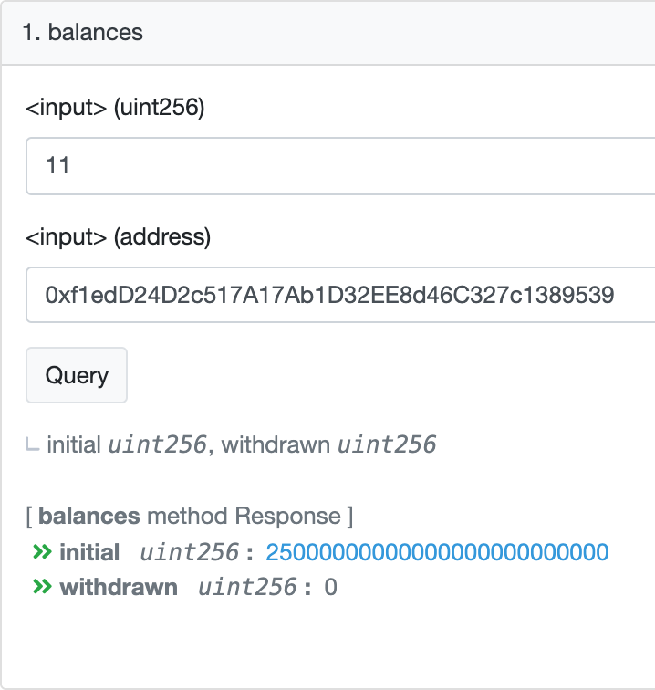
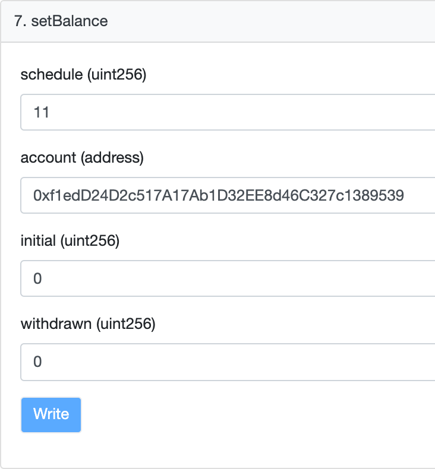
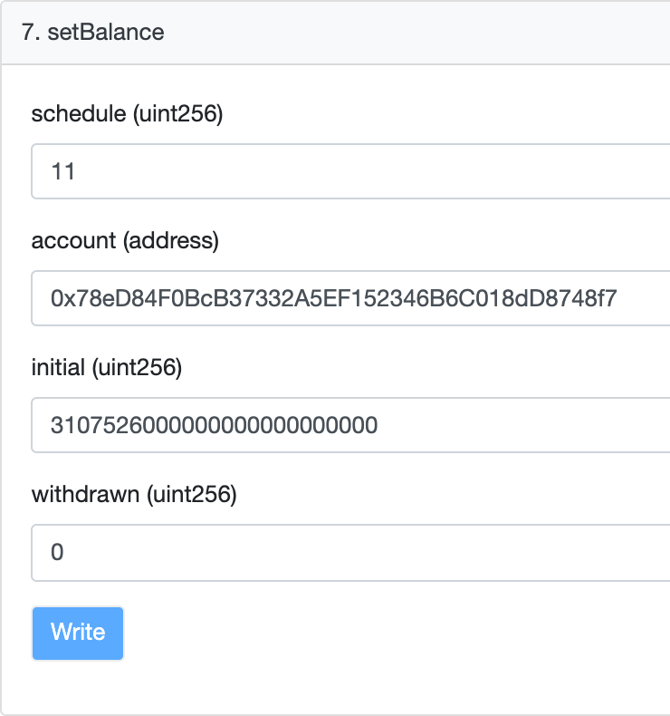

# VestingWallet

### Содежрание
* [Замечания по структуре пользовательского аккаунта в контракте VestingWallet](#vestingwallet-notes)
* [Описание метода setBalance](#setbalance-description)
* [Пример использования метода setBalance](#setbalance-examples)

## Замечания по структуре пользовательского аккаунта в контракте VestingWallet
Аккаунт пользователя в смарт-контракте `VestingWallet` - это структура, которая хранит набор объектов следующего вида:
1. `schedule` - график вестинга, который должен применяться к данному объекту
2. `account` - адрес в сети `ethereum`, которому предназначены токены
3. `initial` - начальное количество заблокированных токенов
4. `withdrawn` - количество токенов, которое пользователь уже вывел

Текущий баланс пользователя для указанного графика `schedule` вычисляется как разница между `initial` и `withdrawn`.  
Суммарный текущий баланс пользователя - это сумма всех балансов для каждного из графиков `schedule`.  
Таким образом, пользователь может участвовать сразу в нескольких графиках вестига, а суммы, которые он выводит,
всегда рассчитываются корректно.  
Все манипуляции над балансами производятся через редактирование описанного выше объекта.

## Описание метода setBalance
Метод `setBalance` - это административный метод, который позволяет напрямую редактировать балансы пользователей.  
В отличие от метода `deposit`, он не требует перевода токенов на адрес смарт-контракта, чем позволяет игнорировать 
элементарную проверку на соответствие баланса смарт-контракта сумме балансов на пользовательских аккаунтах.  
> Используйте этод метод с максимальной осторожностью!

### Пример использования метода setBalance
На примере задачи перераспределения токенов с аккаунта `Launch Team` между несколькими аккаунтами, рассмотрим два основных
способа применения метода `setBalance`.

#### Обнуление баланса аккаунта с помощью метода setBalance
Исходя из ТЗ, Аккаунт `Launch Team` имеет адрес `0xf1edD24D2c517A17Ab1D32EE8d46C327c1389539`. Проверим его баланс с
помощью метода `getAccountInfo`.

Click to see screenshot

1. первое число - количество токенов, удерживаемое для указанного адреса
2. второе число - количество выведенных токенов
3. третье число - количество токенов, доступных для вывода

Аккаунту соответствует график `11`. Убедимся в этом, передав в метод `balances` два значения - номер графика и
адрес.

Click to see screenshot

Чтобы обнулить баланс для этого адреса, вызовем метод `setBalance`, передав в него номер графика, адрес и
значения `initial` и `withdrawn`.

Click to see screenshot

> 11 - это график, закрепленный за Launch Team

#### Установка ненулевого баланса аккаунта с помощью метода setBalance
Один из адресов, между которыми нужно распредилить токены - `0x78eD84F0BcB37332A5EF152346B6C018dD8748f7`.  
Ему нужно начислить `3107526` токенов.  
Проверив баланс с помощью метода `getAccountInfo`, убеждаемся, что у пользователя нет токенов.  
Чтобы начислить токены, вызовем метод `setBalance` с параметрами `11`, `0x78eD84F0BcB37332A5EF152346B6C018dD8748f7`,
`3107526000000000000000000`, `0`.

Click to see screenshot

> Обратите внимание, что перед записью мы сконвертировали токены в wei, домножив число на `10^18`.  
> Воспользуйтесь вот [этим сервисом](https://bscscan.com/unitconverter?wei=3107526000000000000000000) для того, чтобы не вводить нули вручную.
